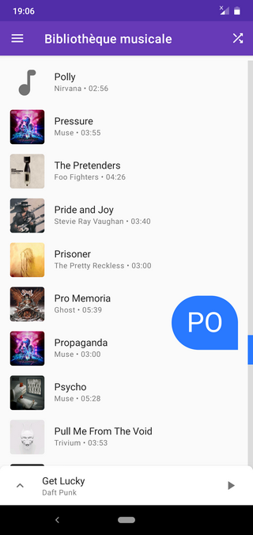
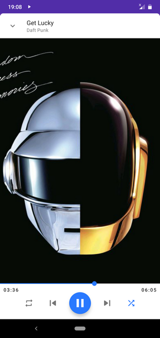
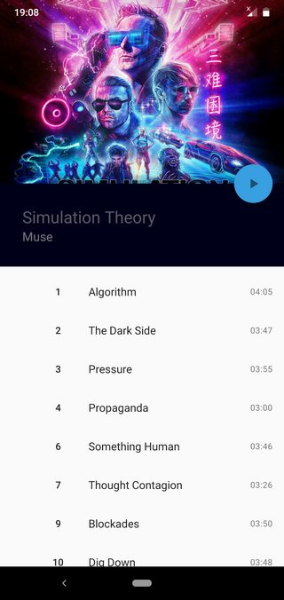

# Odeon :musical_note:

_Odeon Music Player_ is a lightweight music player for Android.
Get it on [Google Play](https://play.google.com/store/apps/details?id=fr.nihilus.music).

We value your privacy, your battery life and your device's storage space.






### Features

_Odeon_ has all features that you'd expect from a music player in a clean and simple interface :

* Browse your music by title, artists and albums.
* Control playback via the interface, the lock screen or headset buttons.
* Create and edit playlists.
* Play tracks that have been added recently or the ones you like the most.
* Control your music safely while driving with [Android Auto](https://www.android.com/intl/fr_fr/auto/) :car:.

The following features are available but experimental :

* Tell the Google Assistant :studio_microphone: what to play.
* Enable Night Mode :first_quarter_moon_with_face: to reduce eye-strain and save your battery life.

### The project

Initially seen as a lightweight alternative to Google Play Music (the music player pre-installed on most Android phones),
the idea behind _Odeon_ gradually matured to become its own thing :
> a smart music player that plays music matching your current mood.

At the time only the basic music player features are completed ; smart playlists are still under development.

#### Developer showcase

_Odeon_ is built with the latest tools and practices for the Android Platform :

* The [Kotlin programming language](https://kotlinlang.org/)
* Asynchronous programming with [Kotlin coroutines](https://github.com/kotlin/kotlinx.coroutines)
* Reactive programming with [RxJava](https://github.com/reactivex/rxjava)
* Dependency Injection with [Dagger 2](https://dagger.dev)
* MVVM Architecture with `Android Architecture Components`
* Test Driven Development

_Odeon_ could then act as a showcase for developers wishing to integrate all those technologies together.
It also demonstrates how to solve common Android problems such as animating icons and transitions between screens.

### What's coming next

The following features are still under development :
* Delete tracks you like least to free-up the device's storage.
* Build smart playlists whose tracks play well together.
* Automatically tag media files to always have the correct album cover.

### License

```
Copyright 2018 Thibault Seisel

Licensed under the Apache License, Version 2.0 (the "License");
you may not use this file except in compliance with the License.
You may obtain a copy of the License at

    http://www.apache.org/licenses/LICENSE-2.0

Unless required by applicable law or agreed to in writing, software
distributed under the License is distributed on an "AS IS" BASIS,
WITHOUT WARRANTIES OR CONDITIONS OF ANY KIND, either express or implied.
See the License for the specific language governing permissions and
limitations under the License.
```
